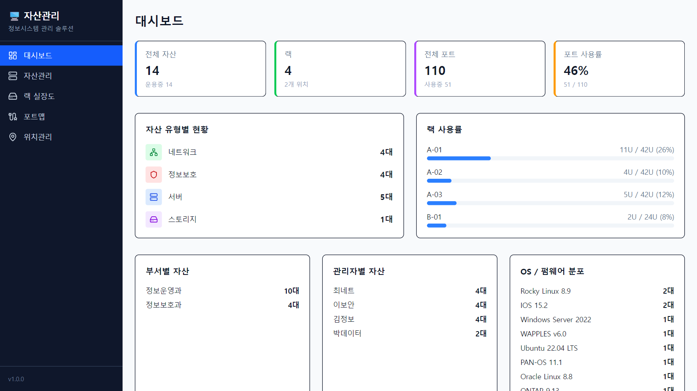
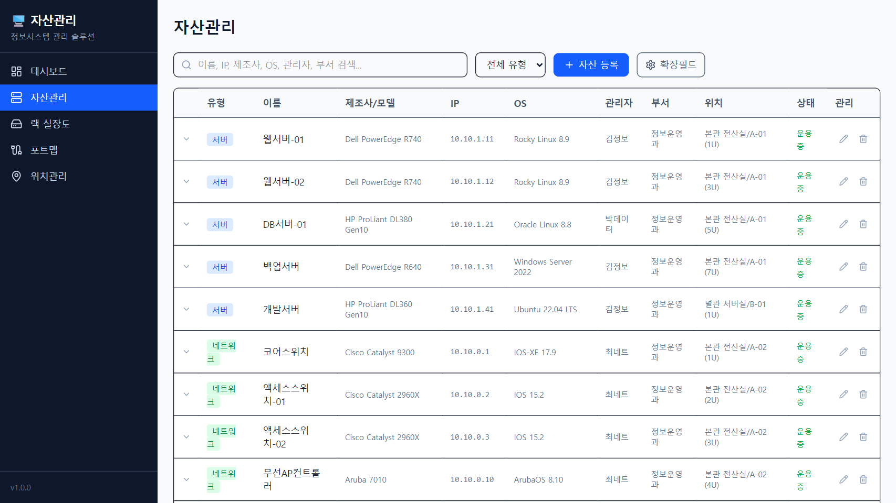
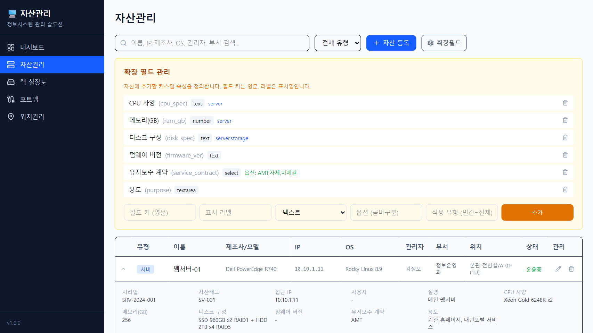

# 정보시스템 자산관리 솔루션

서버, 네트워크, 정보보호시스템 등 IT 자산을 통합 관리하는 웹 기반 솔루션입니다.  
**폐쇄망(인터넷 차단) 환경에서 완전히 독립 운영** 가능하도록 설계되었습니다.

## 주요 기능

### 대시보드
전체 자산 현황, 유형별/부서별/관리자별/OS별 분포, 랙 사용률, 포트 사용률



### 자산관리
서버/네트워크/정보보호/스토리지 장비 CRUD + 확장 고정 필드(OS, 접근IP, 사용자, 관리자, 부서) + 동적 커스텀 필드



### 확장 필드 시스템
사용자가 직접 커스텀 속성을 추가하여 자산 카테고리를 확장 가능 (CPU 사양, 메모리, 디스크, 유지보수 계약 등)



### 랙 실장도
랙별 장비 배치를 시각적으로 확인 (유형별 색상 구분, U 단위 배치)


### 네트워크 포트맵
스위치/장비별 포트 배치도, 포트 상태(사용/미사용/예약), VLAN, 연결 대상 관리


### 위치관리
건물/층/실 기반 위치와 랙 관리, 사용률 시각화


## 기술 스택

| 구분 | 기술 | 비고 |
|------|------|------|
| 프레임워크 | Next.js 15 (App Router) | 서버 컴포넌트 기반 |
| DB | SQLite (better-sqlite3) | 별도 DB 서버 불필요, 파일 1개로 운영 |
| UI | Tailwind CSS 4 | 빌드 시 번들링, 외부 CDN 미사용 |
| 아이콘 | Lucide React | npm 번들, 외부 요청 없음 |
| 언어 | TypeScript | 타입 안전성 |

## 폐쇄망 설치 가이드

### 사전 준비 (인터넷 가능 PC에서)

```bash
# 1. 프로젝트 클론 또는 zip 다운로드
git clone https://github.com/jikim1215/rack.git

# 2. 의존성 설치 (node_modules 생성)
cd rack
npm install

# 3. node_modules를 포함한 전체 폴더를 USB 등으로 폐쇄망 PC에 복사
```

### 폐쇄망 PC에서

```bash
# Node.js 22 이상이 설치되어 있어야 합니다 (오프라인 설치 패키지 사용)

# 1. 시드 데이터 생성 (최초 1회, 샘플 데이터)
npm run db:seed

# 2. 프로덕션 빌드
npm run build

# 3. 서버 실행
npm run start
# 또는 포트 지정
npx next start -p 8080
```

http://localhost:3000 (또는 지정 포트)에서 접속

> **참고**: 모든 자원(JS, CSS, 아이콘)이 빌드 시 번들에 포함되므로 외부 인터넷 연결이 전혀 필요 없습니다.
> Next.js 텔레메트리도 `.env`에서 비활성화되어 있습니다.

## 자산 확장 필드

### 고정 필드 (기본 제공)
| 필드 | 설명 |
|------|------|
| OS / 펌웨어 | 운영체제 또는 펌웨어 버전 |
| 접근 IP | 서비스/접근용 IP |
| 사용자 | 장비 사용자 |
| 관리자 | 장비 관리 담당자 |
| 부서 | 소속 부서 |

### 동적 커스텀 필드
자산관리 페이지의 **확장필드** 버튼으로 자유롭게 추가 가능:
- **텍스트**: 자유 입력 (예: CPU 사양, 디스크 구성)
- **숫자**: 숫자값 (예: 메모리 GB)
- **날짜**: 날짜 선택
- **선택**: 드롭다운 옵션 (예: 유지보수 계약 - AMT/자체/미체결)
- **텍스트영역**: 긴 텍스트 (예: 용도 설명)
- **적용 유형**: 특정 자산 유형에만 표시 가능 (예: `server`, `server,storage`)

## 프로젝트 구조

```
src/
├── app/
│   ├── page.tsx              # 대시보드
│   ├── assets/               # 자산관리 (확장 필드 포함)
│   ├── racks/                # 랙 실장도
│   ├── portmap/              # 네트워크 포트맵
│   ├── locations/            # 위치관리
│   └── api/
│       ├── assets/           # 자산 CRUD
│       ├── custom-fields/    # 커스텀 필드 CRUD
│       ├── locations/        # 위치 CRUD
│       └── racks/            # 랙 CRUD
├── components/
│   └── Sidebar.tsx           # 사이드바
└── lib/
    └── db.ts                 # SQLite 연결, 스키마, 마이그레이션
```

## 데이터 모델

- **locations** - 위치 (건물/층/실)
- **racks** - 랙 (위치 소속, U 단위)
- **assets** - 자산 (유형, 기본정보, OS/접근IP/사용자/관리자/부서, 랙 배치)
- **ports** - 포트 (장비 소속, 포트 간 연결 관계)
- **custom_fields** - 커스텀 필드 정의 (키, 라벨, 타입, 옵션, 적용 유형)
- **custom_values** - 자산별 커스텀 필드 값 (EAV 패턴)
