# 정보시스템 자산관리 솔루션

서버, 네트워크, 정보보호시스템 등 IT 자산을 통합 관리하는 웹 기반 솔루션입니다.
**폐쇄망(인터넷 차단) 환경에서 완전히 독립 운영** 가능하도록 설계되었습니다.

---

## 주요 화면

### 로그인
SHA-512 클라이언트 해싱 + scrypt 서버 이중 해싱, 5회 실패 시 15분 잠금

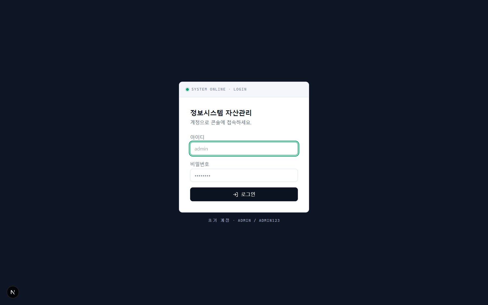

### 대시보드
자산 현황, 유형/부서/관리자/OS 분포, 랙 사용률, 포트 사용률, EoS/보증만료 경고, 데이터 품질 점수

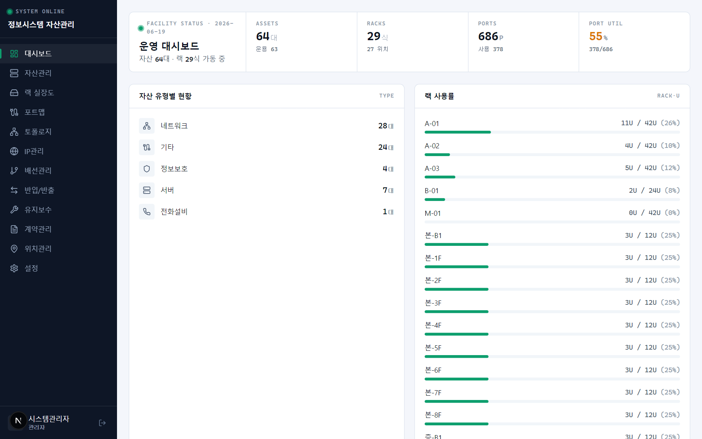
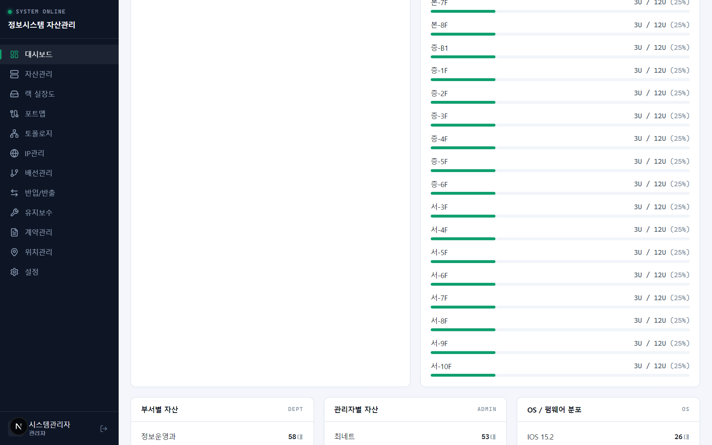

### 자산관리
서버/네트워크/정보보호/전화설비 CRUD, 동적 커스텀 필드, 엑셀 일괄등록/다운로드, 랙 필터

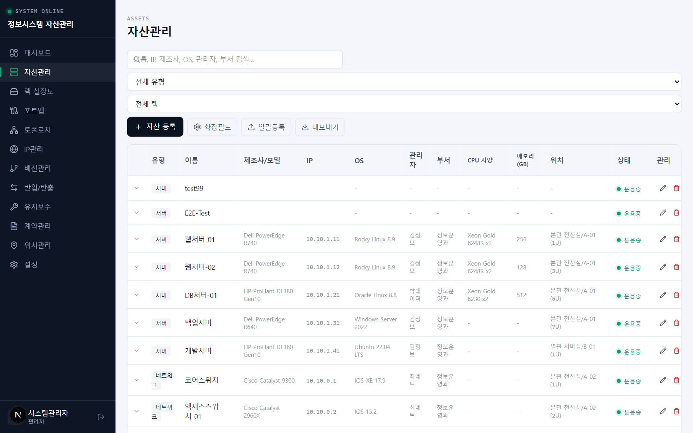

### 랙 실장도
랙별 장비 배치 시각화, 유형별 색상, 충돌/초과 경고(3단계 심각도), KPI 요약 바

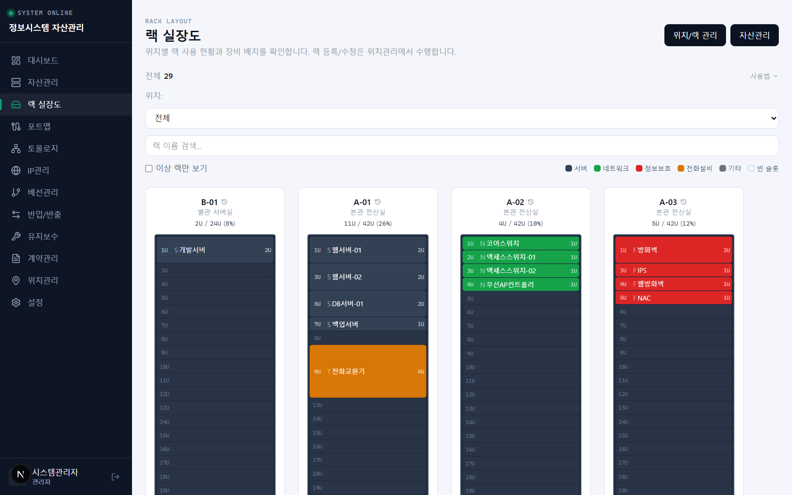

### 네트워크 포트맵
장비별 포트 그리드, 상태/VLAN/속도, 포트 간 연결 설정 UI

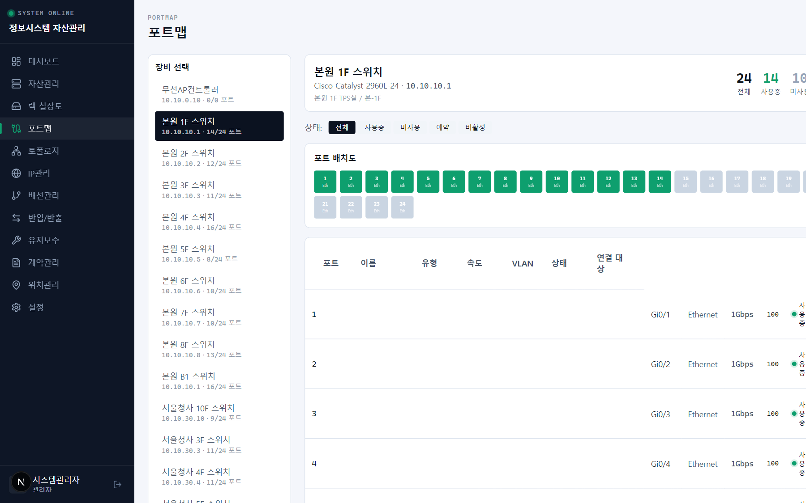

### 네트워크 토폴로지
포트 연결 기반 SVG 토폴로지 시각화, 줌/팬 지원

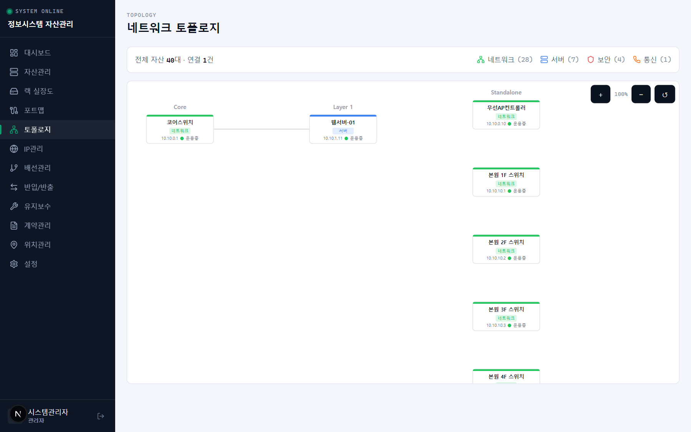

### IP 관리 (IPAM)
서브넷 관리, 256-IP 그리드 시각화, 할당/예약/충돌 표시

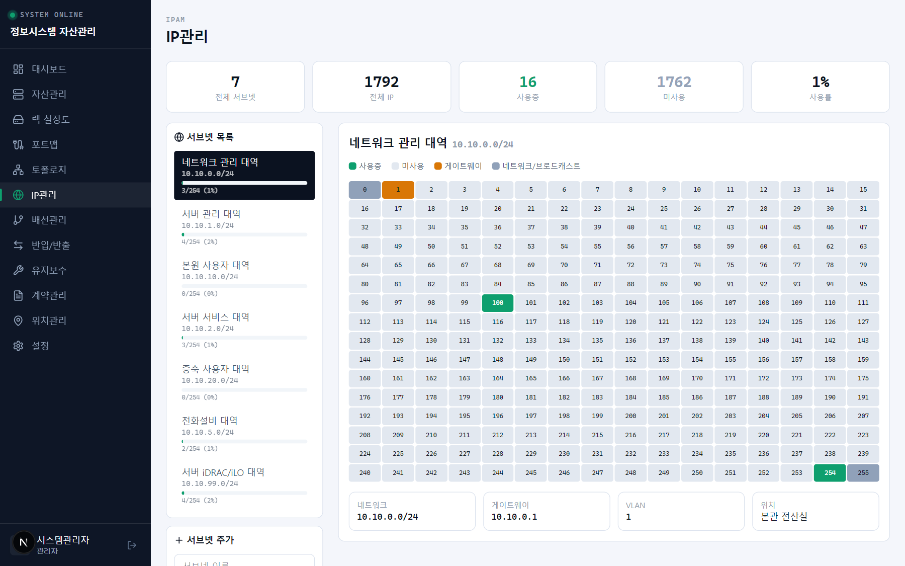

### 배선관리 (MDF/TPS)
110블록 프레임 관리, 페어 단위 배선 추적

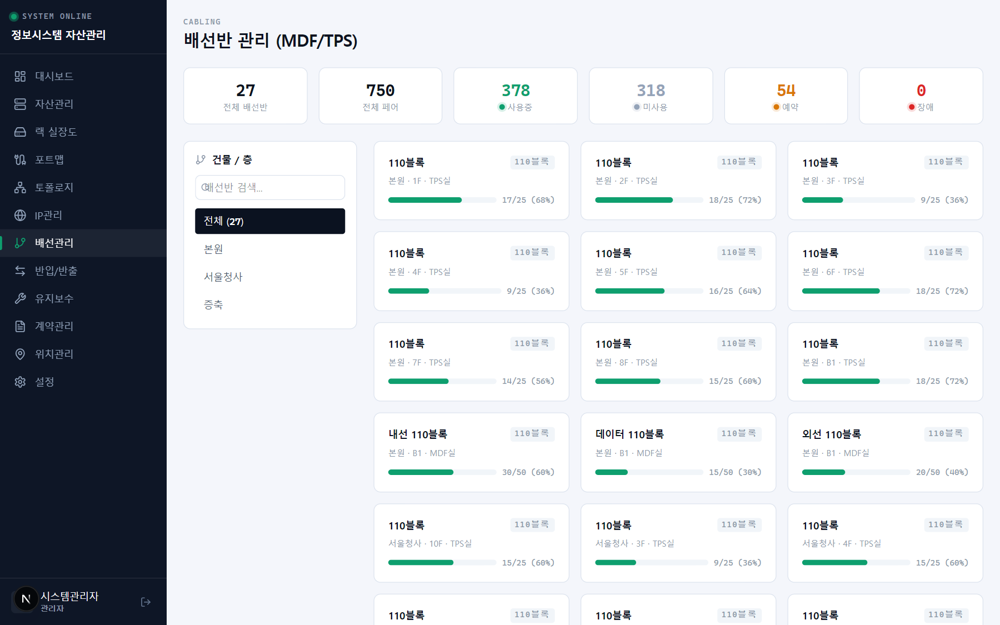

### 반입/반출
장비 반입/반출/반납 이력, 승인 워크플로

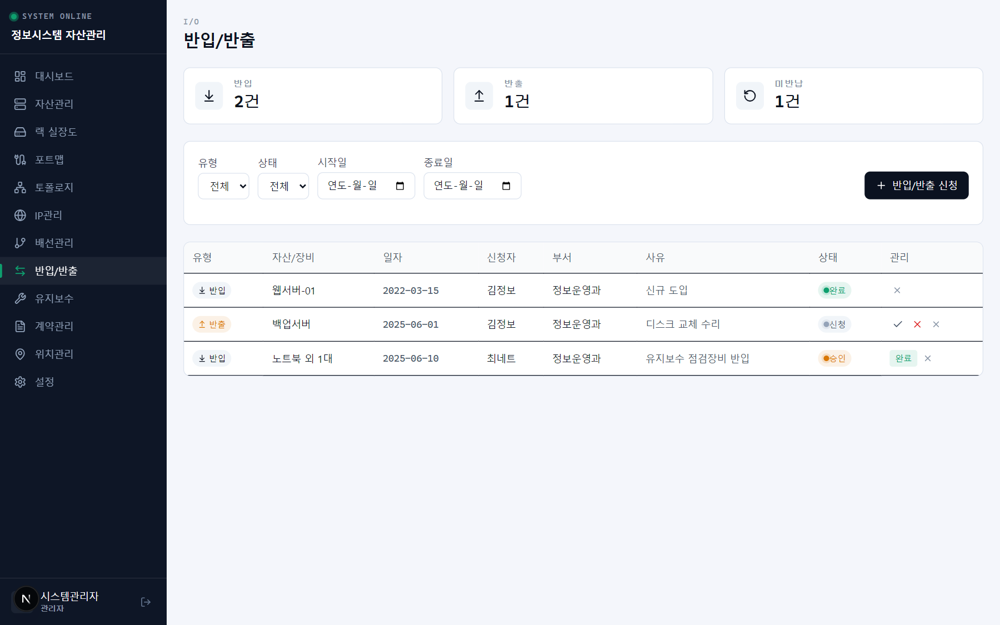

### 유지보수/장애
장애/점검 이력, 심각도 레벨, 벤더 연계

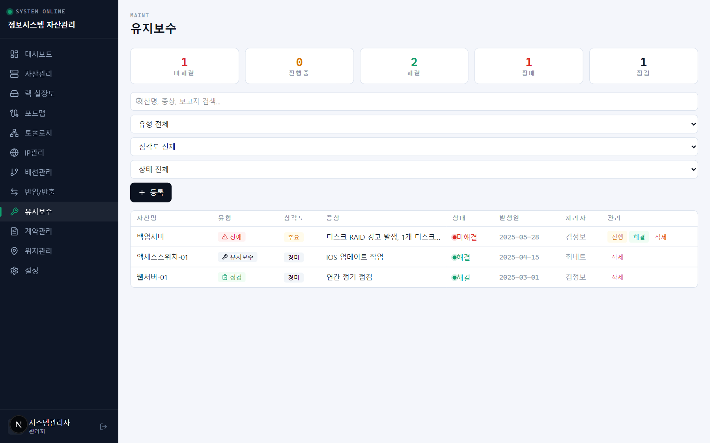

### 계약관리
유지보수/임대 계약, 만료 경고, 자산-계약 N:M 연결

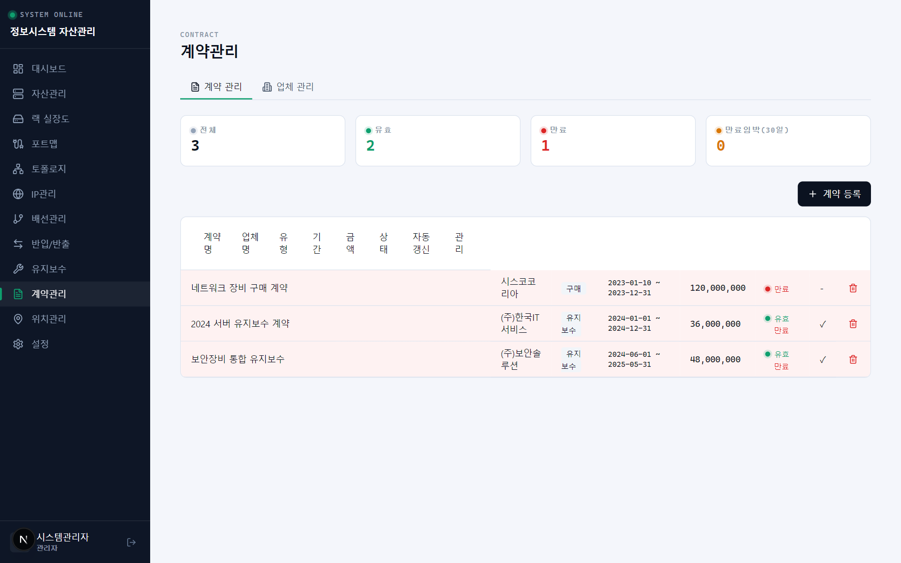

### 위치관리
건물/층/실 기반 위치 + 랙 관리, 클릭 필터 연동, 사용률 바

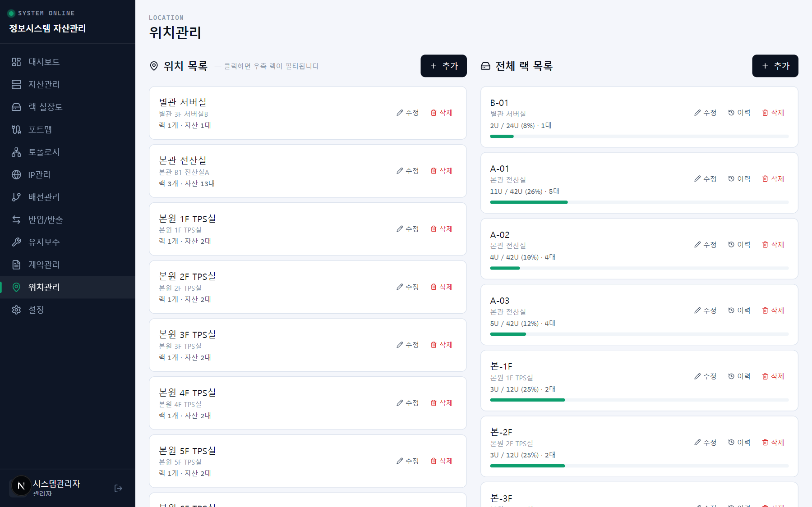

### 설정
사용자 관리, 메뉴 권한(역할별), 비밀번호 변경

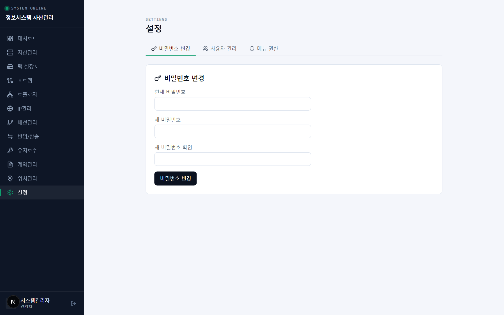

---

## 기술 스택

| 구분 | 기술 | 비고 |
|------|------|------|
| 프레임워크 | Next.js 15 (App Router) | 서버 컴포넌트 + standalone 빌드 |
| DB | SQLite (better-sqlite3) | 파일 1개로 운영, 별도 DB 서버 불필요 |
| UI | Tailwind CSS 4 | 빌드 시 번들링, 외부 CDN 미사용 |
| 아이콘 | Lucide React | npm 번들, 외부 요청 없음 |
| 엑셀 | SheetJS (xlsx) | 일괄등록/다운로드 |
| 언어 | TypeScript | 전체 타입 안전성 |

## 보안

- SHA-512 클라이언트 해싱 → scrypt 서버 이중 해싱
- HMAC-SHA512 세션 토큰, SameSite=strict 쿠키
- 로그인 5회 실패 → 15분 잠금
- 역할 기반 접근 제어 (admin/user/viewer)
- 메뉴별 접근/쓰기/승인 권한
- 파일 업로드 매직바이트 검증
- 모든 쓰기 API 인증 필수

## 폐쇄망 배포

자세한 배포 절차는 [docs/DEPLOY.md](docs/DEPLOY.md) 참조

### 간편 배포 (포터블 패키지)

```bash
# 1. 빌드 PC에서 패키지 생성
powershell -ExecutionPolicy Bypass -File scripts/deploy/pack-portable.ps1

# 2. rack-portable.tar.gz를 서버에 전송 (USB/망연계)

# 3. 서버에서 설치
tar -xzf rack-portable.tar.gz
cd rack-portable
sudo bash setup.sh
```

설치 후 `http://<서버IP>:3000` 접속, `admin` / `admin123` 로그인

## 데이터 모델

18개 테이블: users, locations, racks, assets, asset_ips, ports, custom_fields, custom_values, audit_logs, dist_frames, frame_pairs, vendors, contracts, contract_assets, asset_movements, maintenance_logs, ip_subnets, menu_permissions

## 프로젝트 구조

```
src/
├── app/
│   ├── page.tsx              # 대시보드
│   ├── assets/               # 자산관리
│   ├── racks/                # 랙 실장도
│   ├── portmap/              # 포트맵
│   ├── topology/             # 토폴로지
│   ├── ipam/                 # IP관리
│   ├── distribution/         # 배선관리
│   ├── movements/            # 반입/반출
│   ├── maintenance/          # 유지보수
│   ├── contracts/            # 계약관리
│   ├── locations/            # 위치관리
│   ├── settings/             # 설정
│   ├── login/                # 로그인
│   └── api/                  # 38개 REST API
├── components/               # 공통 컴포넌트
│   ├── Sidebar.tsx
│   ├── LayoutShell.tsx
│   ├── Toast.tsx
│   └── AuditLogModal.tsx
├── lib/
│   ├── db.ts                 # SQLite 스키마 + 연결
│   ├── auth.ts               # 인증/세션
│   ├── audit.ts              # 감사 로그
│   └── rack-validation.ts    # 랙 무결성 검증
└── middleware.ts              # 인증 미들웨어
```
