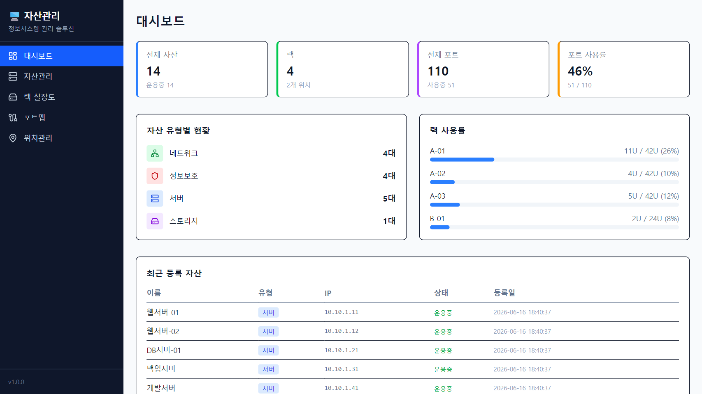
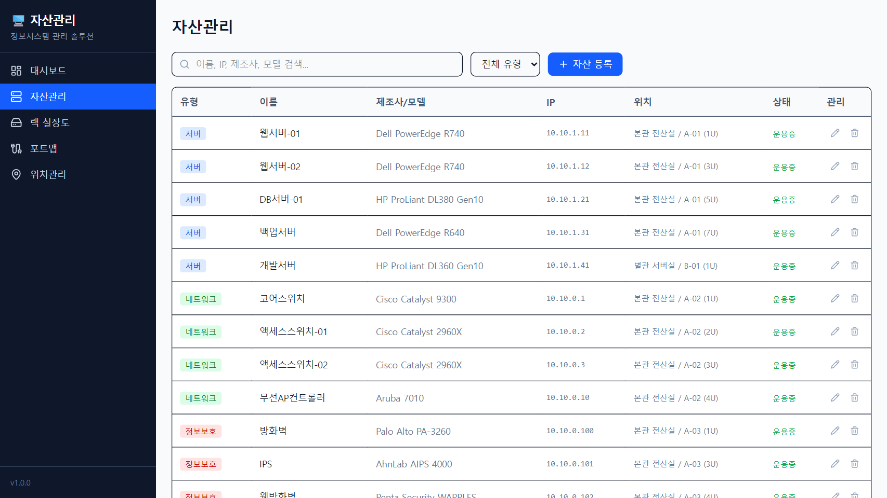
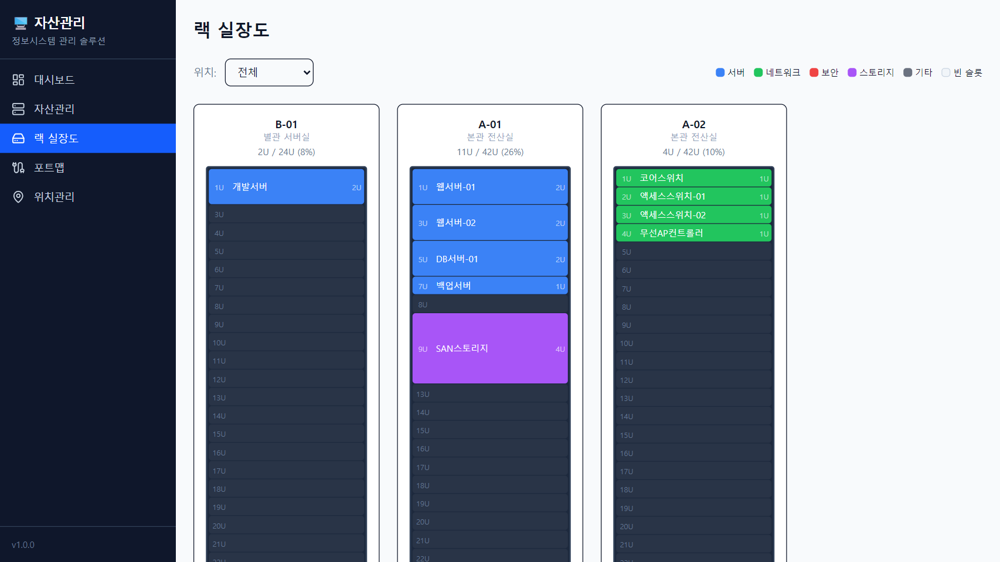
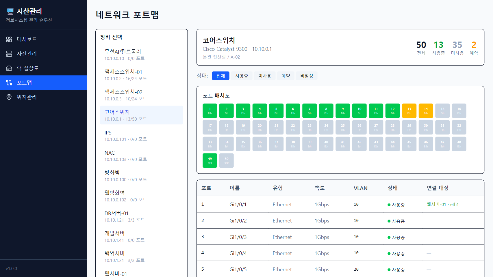
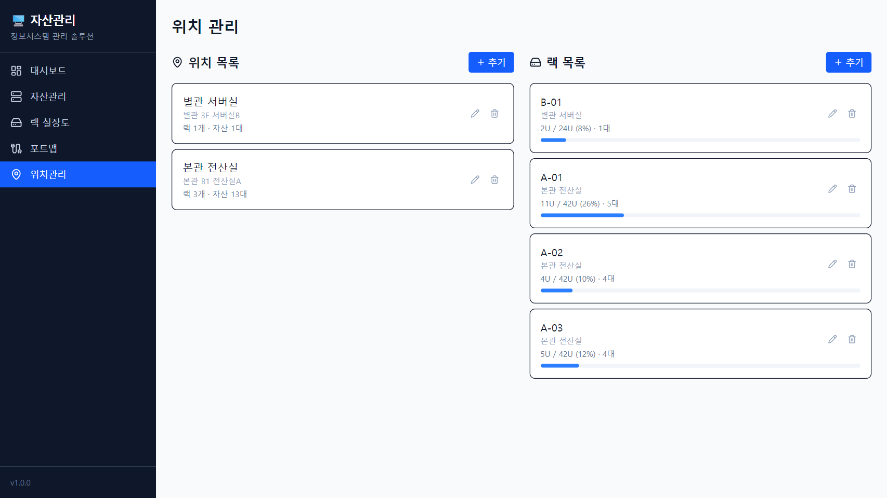

# 정보시스템 자산관리 솔루션

서버, 네트워크, 정보보호시스템 등 IT 자산을 통합 관리하는 웹 기반 솔루션입니다.

## 주요 기능

### 대시보드
전체 자산 현황, 유형별 분포, 랙 사용률, 포트 사용률을 한눈에 파악



### 자산관리
서버/네트워크/정보보호/스토리지 장비의 등록, 수정, 삭제, 검색



### 랙 실장도
랙별 장비 배치를 시각적으로 확인 (유형별 색상 구분, U 단위 배치)



### 네트워크 포트맵
스위치/장비별 포트 배치도, 포트 상태(사용/미사용/예약), VLAN, 연결 대상 관리



### 위치관리
건물/층/실 기반 위치와 랙 관리, 사용률 시각화



## 기술 스택

- **Next.js 15** (App Router, Server Components)
- **SQLite** (better-sqlite3) - 별도 DB 서버 불필요
- **Tailwind CSS 4**
- **Lucide React** 아이콘
- **TypeScript**

## 설치 및 실행

```bash
# 의존성 설치
npm install

# 시드 데이터 생성 (샘플 데이터)
npm run db:seed

# 개발 서버 실행
npm run dev
```

http://localhost:3000 에서 접속

## 프로덕션 빌드

```bash
npm run build
npm run start
```

## 프로젝트 구조

```
src/
├── app/
│   ├── page.tsx              # 대시보드
│   ├── assets/               # 자산관리
│   ├── racks/                # 랙 실장도
│   ├── portmap/              # 네트워크 포트맵
│   ├── locations/            # 위치관리
│   └── api/                  # REST API
│       ├── assets/
│       ├── locations/
│       └── racks/
├── components/
│   └── Sidebar.tsx           # 사이드바 네비게이션
└── lib/
    └── db.ts                 # SQLite DB 연결 및 스키마
```

## 데이터 모델

- **locations** - 위치 (건물/층/실)
- **racks** - 랙 (위치 소속, U 단위)
- **assets** - 자산 (서버/네트워크/보안/스토리지, 랙 배치 정보)
- **ports** - 포트 (장비 소속, 포트 간 연결 관계)
