# 정보시스템 자산 현황관리 시스템

서버·네트워크·정보보호·전화설비 등 정보시스템 자산을 통합 관리하는 웹 기반 솔루션입니다.
**폐쇄망(인터넷 차단) 환경에서 완전히 독립 운영**되도록 설계됐으며, 부서 기반 멀티팀 권한과
엑셀 대량 이관/검증, 랙·포트·배선 시각화, 감사·접속 로그 보존을 제공합니다.

---

## 주요 화면

### 로그인
이메일 기반 로그인 ID. SHA-512 클라이언트 해싱 + scrypt 서버 이중 해싱, 5회 실패 시 15분 잠금.

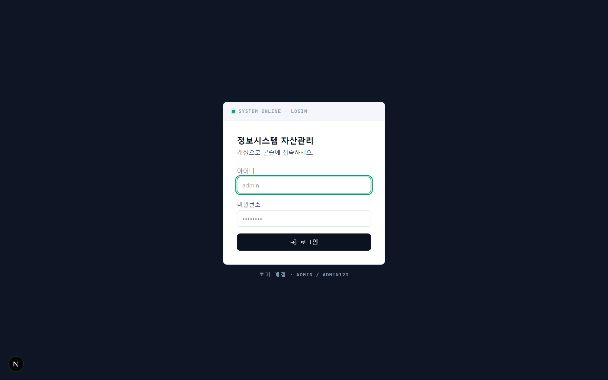

### 대시보드
전체/팀별 자산 수, 유형·부서·관리자·OS 분포, 랙/포트 사용률, EoS·보증만료 경고, 데이터 품질 점수, 정리 필요 큐(IP·OS·관리자·랙 미입력).

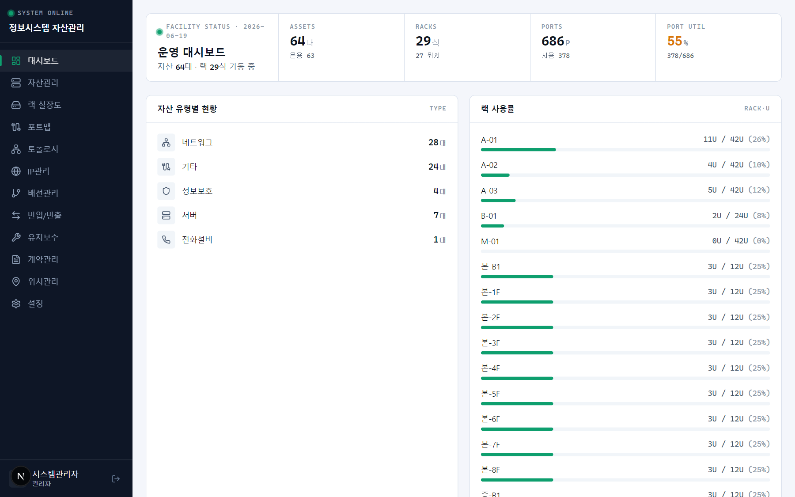
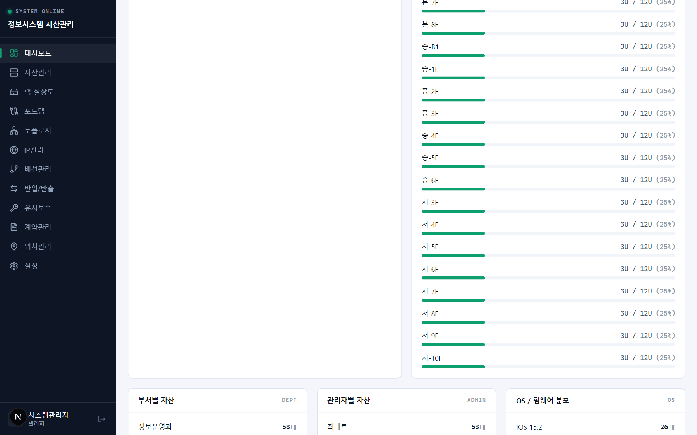

### 자산관리
서버/네트워크/보안/전화설비/VM/기타 CRUD, 동적 커스텀 필드, 다중 IP, 엑셀 일괄등록·다운로드·업로드 검증, 랙/유형 필터.

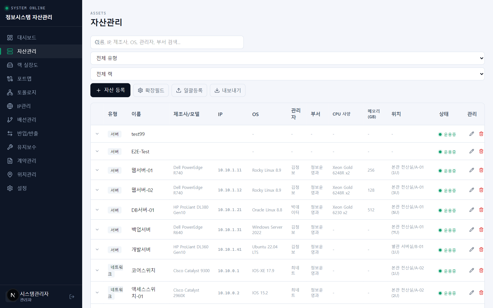

### 랙 실장도
랙별 장비 배치 시각화, 유형별 색상, 반폭(L/R) 배치, 충돌/범위초과 경고(3단계 심각도), KPI 요약 바.

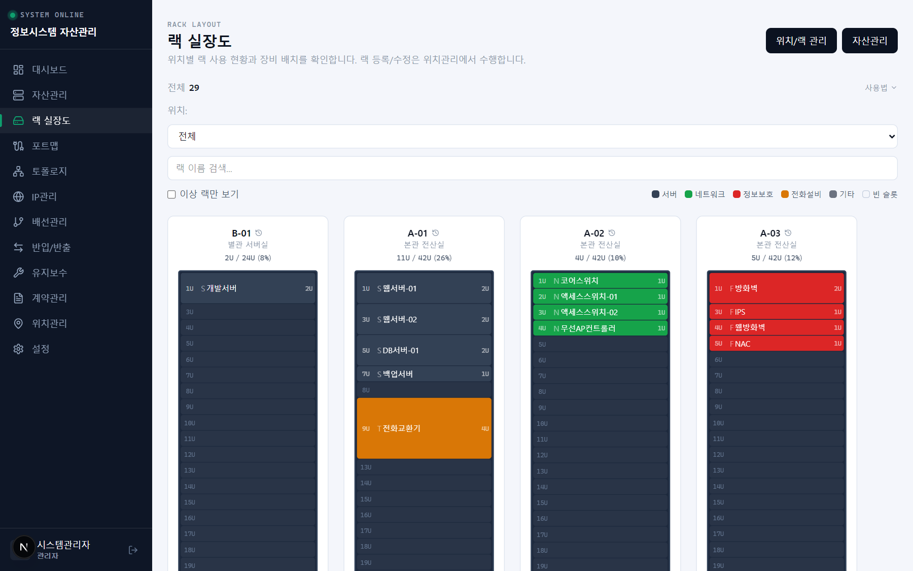

### IP 관리 (IPAM)
서브넷 관리, 256-IP 그리드 시각화, 할당/예약/게이트웨이/충돌 표시, 공인 IP 중복 차단.

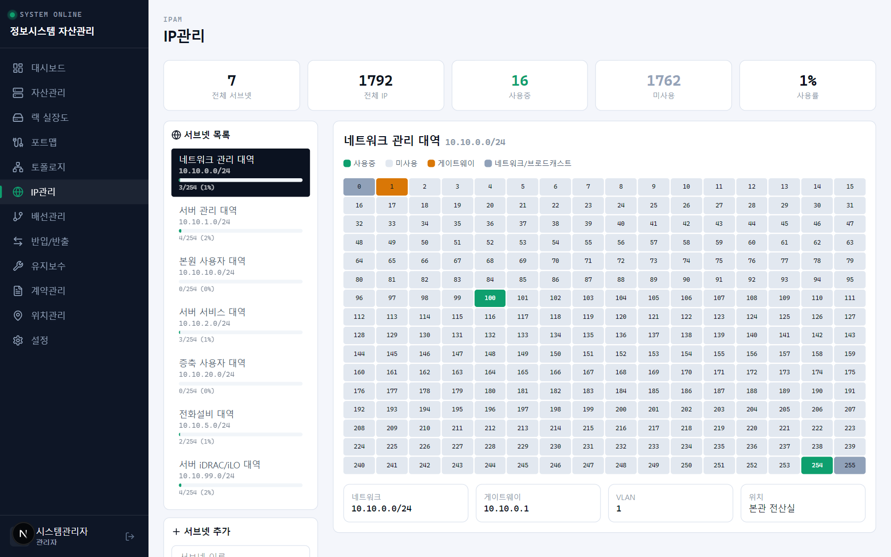

### 배선관리 (MDF/TPS)
110블록·패치패널 등 배선반 관리, 페어 단위 배선 추적, 랙 연계.

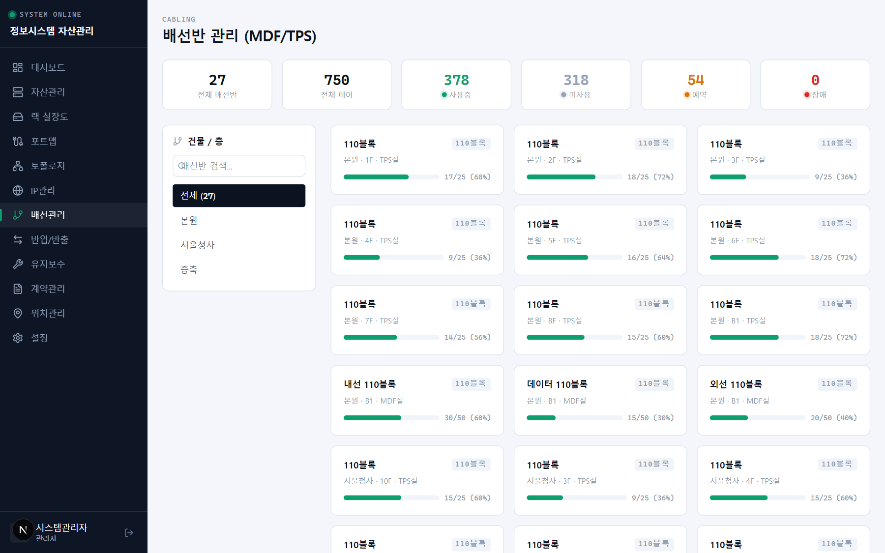

### 반입/반출
장비 반입/반출/반납 이력, 승인 워크플로, 자산 연계.

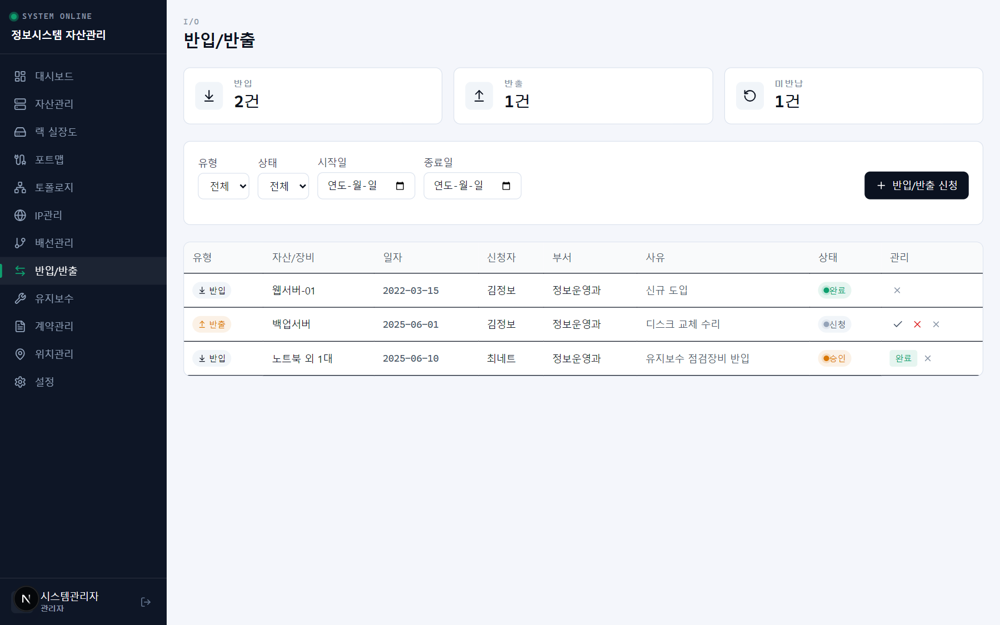

### 유지보수/장애
장애/점검/유지보수 이력, 심각도 레벨, 벤더 연계, 유지관리 대상 대장 임포트.

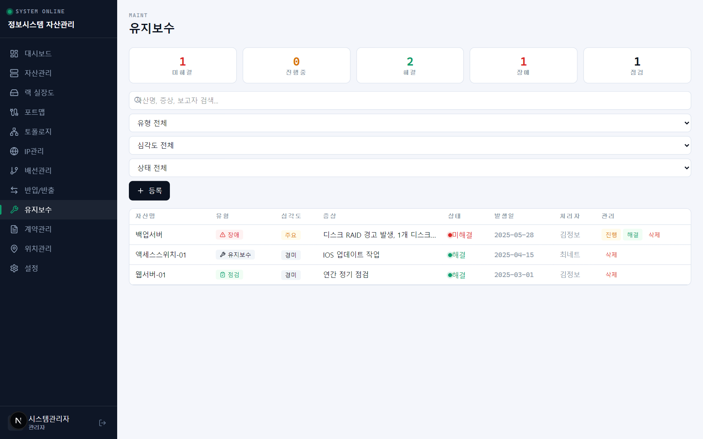

### 자산실사(재물조사)
실사 회차 관리, 자산별 실사 체크(확인/불일치/미확인), 결과 집계.

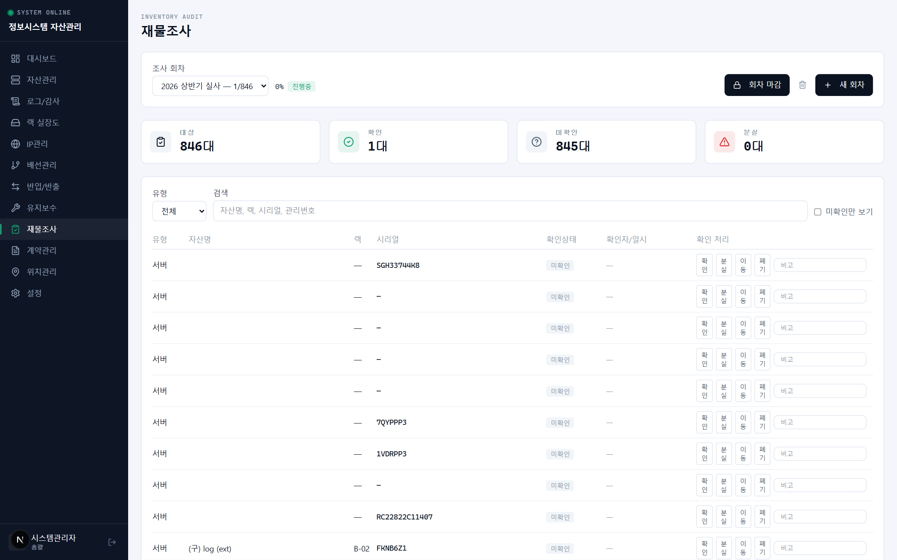

### 계약관리
유지보수/구매/임대 계약, 만료·만료임박 경고, 자산-계약 N:M 연결, 업체(벤더) 관리.

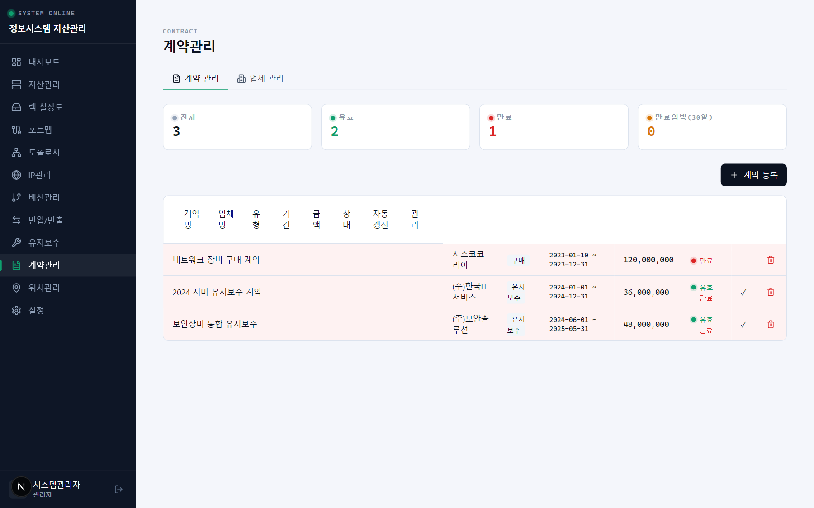

### 위치관리
건물/층/실 기반 위치 + 랙 관리, 클릭 필터 연동, 사용률 바.

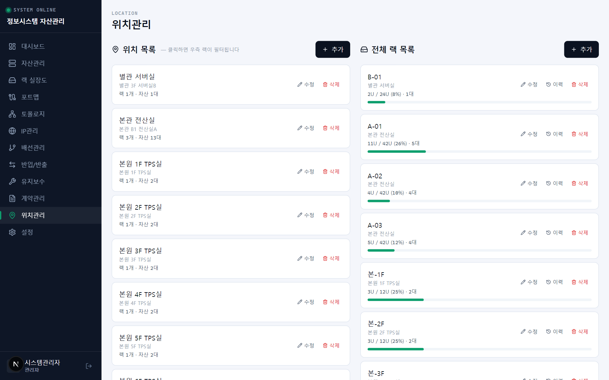

### 설정
사용자 관리(생성·역할·팀·이메일 변경·비활성·삭제·비밀번호 초기화·허용 IP), 메뉴 권한(역할별 접근/쓰기/승인), 메일 릴레이 설정, 비밀번호 변경.

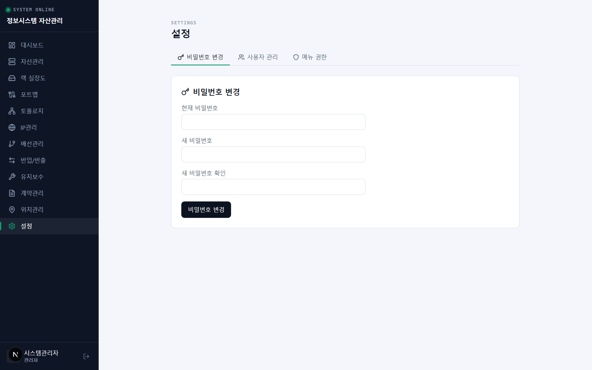

### 그 외
- **부속자산** — 본체 자산에 딸린 구성품(부속) 관리, 엑셀 임포트/익스포트
- **통계 리포트** — 유형·부서·상태·EoS 등 집계 리포트
- **미배정 큐** — 소유팀(부서) 공란 자산을 총괄이 재배정
- **로그/감사** — 변경 감사로그·접속 로그 조회(각 1년 보존)
- **임포트 이슈** — 엑셀 업로드 검증 결과(형식오류/중복의심/식별자없음/OS미입력) 정리 큐

### 2차 로드맵 (구현됨 · 현재 메뉴 비노출)
**포트맵**(`/portmap`) · **네트워크 토폴로지**(`/topology`) 화면과 API는 구현돼 있으나,
실 포트 연결 데이터가 없는 빈 화면은 완성도의 거짓 신호가 되므로 **사이드바 메뉴에서 내려둔 상태**입니다.
포트 실데이터 도입 시 메뉴에 복원됩니다. (라우트 직접 접근 시에는 동작)

---

## 기술 스택

| 구분 | 기술 | 비고 |
|------|------|------|
| 프레임워크 | Next.js 15 (App Router) | 서버 컴포넌트 + standalone 빌드 |
| 런타임 | Node.js 20 (LTS) | 폐쇄망 오프라인 번들에 포함 |
| DB | SQLite (better-sqlite3, WAL) | 파일 1개로 운영, 별도 DB 서버 불필요 |
| UI | Tailwind CSS 4 | 빌드 시 번들링, 외부 CDN 미사용 |
| 아이콘 | Lucide React | npm 번들, 외부 요청 없음 |
| 엑셀 | SheetJS (xlsx) | 일괄등록/다운로드/검증 |
| 메일 | Nodemailer | 사내 SMTP 릴레이(허용 IP·무인증), 알림 전용 |
| 언어 | TypeScript (strict) | 전체 타입 안전성 |

> 폐쇄망 원칙: 외부 CDN·폰트·API·텔레메트리 등 일체의 외부 네트워크 요청 없음.

## 보안

- 이메일 기반 로그인 ID, SHA-512 클라이언트 해싱 → scrypt 서버 이중 해싱
- HMAC-SHA512 서명 세션 토큰, `SameSite=strict` 쿠키, 세션 만료 배너
- 로그인 5회 실패 → 15분 잠금, 비밀번호 정책(최소 8자·2종 조합)
- 3역할 접근제어: **총괄(admin) / 팀(team) / 전체열람(viewer)**
- 부서 기반 **row-level 멀티팀 스코프** — 모든 쓰기 API에서 (역할, 소유팀) 서버 인가 검증
- 메뉴별 접근/쓰기/승인 권한, 계정별 허용 IP
- 파일 업로드 매직바이트 검증, 모든 쓰기 API 인증 필수
- 변경 감사로그 / 접속 로그 각 1년 보존 및 자동 프루닝
- 비밀번호 초기화 = 사용자 이메일로 설정 + 강제변경(전달할 비밀 없음)

## 폐쇄망 배포

RockyLinux 8.10(OS만 설치)에 **완전 자립 오프라인 번들**로 배포합니다. 자세한 절차·옵션은
[docs/DEPLOY.md](docs/DEPLOY.md), TLS 구성은 [docs/deploy-tls.md](docs/deploy-tls.md) 참조.

```bash
# 1) 빌드(리눅스/WSL2) — Node 런타임 + linux-x64 better-sqlite3 + 전체 의존성 포함
bash scripts/deploy/build-release.sh          # → dist/asset-inventory-offline.tar.gz

# 2) 서버로 번들 전송(USB/망연계) 후 무인터넷 설치 (systemd 등록 + 최초 DB 초기화)
tar xzf asset-inventory-offline.tar.gz
sudo bash install.sh

# 3) HTTPS(nginx 리버스프록시 또는 Node TLS, self-signed) 접속
#    admin@example.go.kr / admin123  →  첫 로그인 시 비밀번호 변경 필수
```

> 실제 자산 데이터는 배포 후 **엑셀 임포트**로 투입합니다(번들·저장소에는 데모/시드 데이터만 포함).
> 운영 DB(`data.db`)·엑셀 원장·`.env`·인증서 등 민감·산출물은 저장소에서 제외됩니다(`.gitignore`).

## 데이터 모델

27개 테이블 (SQLite, `src/lib/db.ts`):

- **자산**: `assets`, `asset_ips`, `sub_assets`, `custom_fields`, `custom_values`, `ports`
- **물리/배치**: `locations`, `racks`, `dist_frames`, `frame_pairs`, `ip_subnets`
- **운영**: `asset_movements`, `maintenance_logs`, `maintenance_targets`, `contracts`, `contract_assets`, `vendors`, `inventory_audits`, `inventory_audit_checks`
- **계정/권한/감사**: `users`, `teams`, `menu_permissions`, `audit_logs`, `access_logs`, `login_attempts`, `import_issue`
- **설정**: `mail_relay_config`

자산 상태 생명주기: `active`(운용) / `maintenance`(유지보수) / `standby`(예비) / `retired`(폐기).

## 개발 빠른 시작

```bash
npm install
npm run db:seed        # 스키마 + 데모 데이터 + 계정 3종 초기화 (SEED_MINIMAL=1 이면 스키마·계정만)
npm run dev            # http://localhost:3000
```

시드 기본 계정(개발용, 운영 배포 시 변경 필수):

| 역할 | 계정 | 비밀번호 |
|------|------|----------|
| 총괄(admin) | `admin@example.go.kr` | `admin123` |
| 팀(team) | `user@example.go.kr` | `user123` |
| 전체열람(viewer) | `viewer@example.go.kr` | `viewer123` |

기타 스크립트: `npm test`(단위 테스트), `npm run check`(타입 체크), `npm run smoke`(스모크).

## 프로젝트 구조

```
src/
├── app/
│   ├── page.tsx              # 대시보드
│   ├── assets/               # 자산관리
│   ├── subassets/            # 부속자산
│   ├── racks/                # 랙 실장도
│   ├── portmap/                # 포트맵 (2차 · 메뉴 비노출)
│   ├── topology/                # 토폴로지 (2차 · 메뉴 비노출)
│   ├── ipam/                 # IP관리
│   ├── distribution/         # 배선관리
│   ├── movements/            # 반입/반출
│   ├── maintenance/          # 유지보수
│   ├── inspection/           # 자산실사(재물조사)
│   ├── contracts/            # 계약관리
│   ├── reports/              # 통계 리포트
│   ├── locations/            # 위치관리
│   ├── unassigned/           # 미배정 큐
│   ├── import-issues/        # 임포트 이슈
│   ├── logs/                 # 로그/감사
│   ├── settings/             # 설정
│   ├── login/                # 로그인
│   ├── change-password/      # 비밀번호 변경
│   └── api/                  # 60개 REST API 라우트
├── components/               # 공통 컴포넌트 (Sidebar, LayoutShell, Toast, AuditLogModal, Onboarding, SessionExpiryBanner, UsageGuide …)
├── lib/
│   ├── db.ts                 # SQLite 스키마 + 연결 + 마이그레이션
│   ├── auth-core.ts / auth.ts# 인증·세션·비밀번호 정책
│   ├── authz.ts              # 역할·부서 row-level 인가
│   ├── audit.ts              # 감사 로그
│   ├── access-log.ts / retention.ts  # 접속 로그·보존 프루닝
│   ├── validation/           # 엑셀/자산 검증 규칙
│   └── …                     # ip-utils, mail-config, rack-validation 등
└── middleware.ts             # 인증·권한 미들웨어

scripts/deploy/               # 오프라인 번들 빌드·설치·nginx·TLS·백업·보존
docs/                         # 배포/운영/사용자·관리자 매뉴얼, 아키텍처, 보안 체크리스트
tests/                        # 단위 테스트 (node --test)
```
